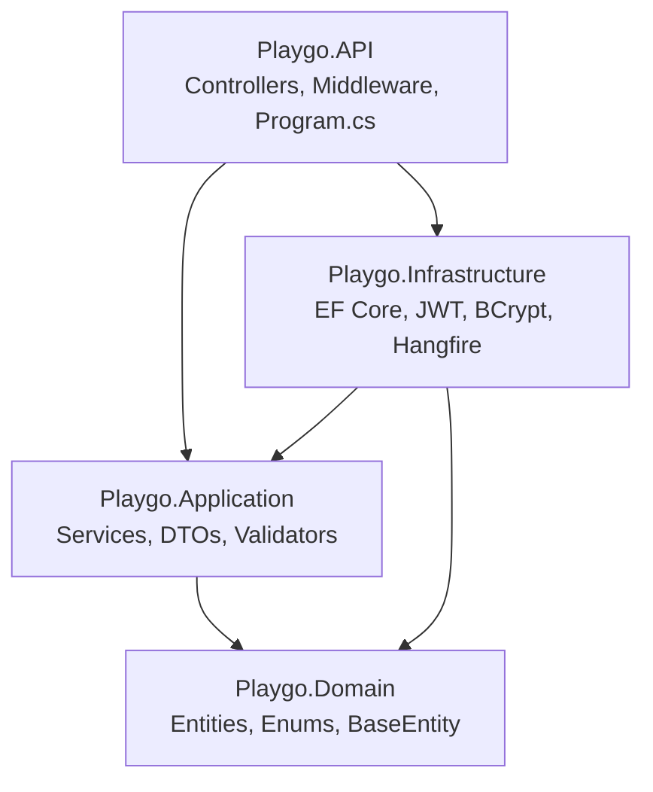
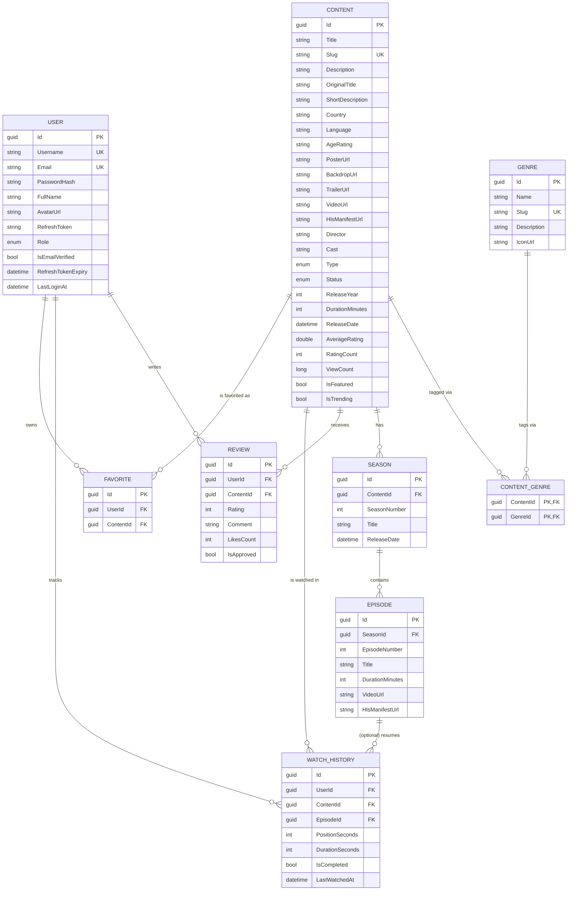
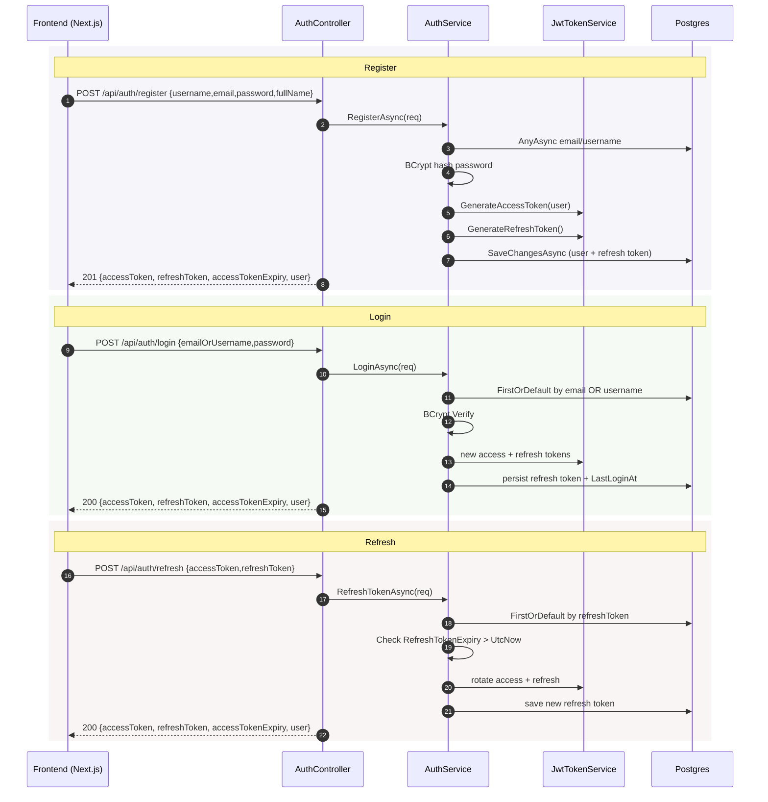
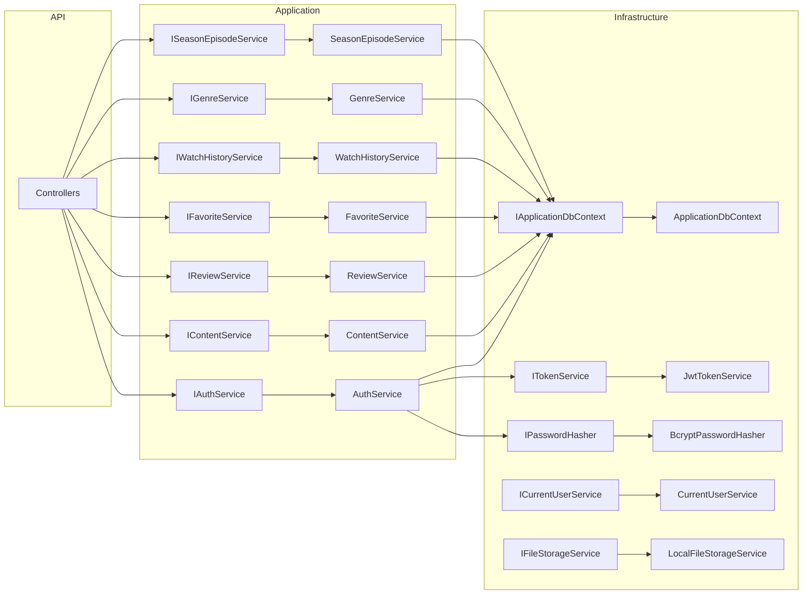

# 01 — Architecture Overview

> Snapshot of the Playgo backend as of branch `feature/01-audit` (post `a31c44a`).
> Every claim below is anchored to `path:line` so it can be re-verified.

---

## 1. Tech Stack

| Component | Version / Lib | Purpose | Anchor |
|-----------|---------------|---------|--------|
| Runtime | .NET 8 (`net8.0`) | ASP.NET Core Web API | `playgo-backend.sln`, `global.json` |
| Web framework | ASP.NET Core MVC controllers | HTTP endpoints | `src/Playgo.API/Program.cs:26` |
| ORM | EF Core 8 (Npgsql provider) | Postgres access, migrations | `src/Playgo.Infrastructure/DependencyInjection.cs:20-22` |
| Database | PostgreSQL 16 | Primary store | `appsettings.json:3` |
| Cache | Redis 7 (StackExchange) | Registered as `IDistributedCache` (**not yet consumed**) | `src/Playgo.Infrastructure/DependencyInjection.cs:26-31` |
| Auth | JWT Bearer (HS256) | Stateless access + opaque refresh | `src/Playgo.Infrastructure/Services/JwtTokenService.cs:42-53` |
| Password hashing | BCrypt.Net (workFactor 12) | User passwords | `src/Playgo.Infrastructure/Services/BcryptPasswordHasher.cs:8` |
| Background jobs | Hangfire + Postgres storage | Recurring jobs (cleanup, trending) | `src/Playgo.Infrastructure/DependencyInjection.cs:43-45` |
| Validation | FluentValidation | DTO input rules | `src/Playgo.Application/DependencyInjection.cs:19` |
| Logging | Serilog | Structured + request logging | `src/Playgo.API/Program.cs:20, 84` |
| API docs | Swashbuckle / Swagger | OpenAPI + JWT-aware UI | `src/Playgo.API/Extensions/SwaggerExtensions.cs:11-43` |
| File storage | Local filesystem (`wwwroot/uploads`) | Image/video uploads | `src/Playgo.Infrastructure/Services/LocalFileStorageService.cs:11-15` |
| Compression | Brotli + Gzip | Response compression | `src/Playgo.API/Program.cs:66-71` |
| Health checks | `AspNetCore.HealthChecks.NpgSql` + Redis | `/health` endpoint | `src/Playgo.API/Program.cs:74-76, 103` |

---

## 2. Project Structure

```
src/
├── Playgo.Domain/         # Pure C#, no external refs
├── Playgo.Application/    # Service interfaces + impls, DTOs, validators
├── Playgo.Infrastructure/ # EF Core, JWT, BCrypt, File storage, Hangfire
└── Playgo.API/            # Controllers, middleware, Program.cs (composition root)
tests/
└── Playgo.Tests/          # Currently a scaffold (`UnitTest1.cs` only)
```

| Project | Role | Key files |
|---------|------|-----------|
| `Playgo.Domain` | Entities + enums. No EF / ASP.NET references. | `Entities/*.cs`, `Common/BaseEntity.cs`, `Enums/Enums.cs` |
| `Playgo.Application` | Use-cases (services), DTO records, FluentValidation rules, abstract interfaces. | `Services/*.cs`, `DTOs/**/*.cs`, `Validators/Validators.cs`, `Common/Result.cs` |
| `Playgo.Infrastructure` | EF Core `DbContext`, entity configurations, migrations, concrete `ITokenService`/`IPasswordHasher`/`IFileStorageService`/`ICurrentUserService`, Hangfire jobs. | `Persistence/ApplicationDbContext.cs`, `Persistence/Configurations/*.cs`, `Services/*.cs`, `Identity/HangfireJobsSetup.cs` |
| `Playgo.API` | HTTP surface: controllers, middleware, JWT setup, CORS, Swagger, Hangfire dashboard, health checks. | `Program.cs`, `Controllers/*.cs`, `Middleware/*.cs`, `Extensions/*.cs` |

---

## 3. Layer Dependencies



- `API` is the only composition root that references `Infrastructure` (`Program.cs:12-14`).
- `Application` depends **only** on `Domain` — Infrastructure types never leak upward.
- `IApplicationDbContext` is defined in `Application` (`Common/Interfaces/IApplicationDbContext.cs:6-19`) and implemented by `ApplicationDbContext` in `Infrastructure` — the standard Clean Architecture inversion.

---

## 4. Entity Relationship Diagram



All entities extend `BaseEntity` (`src/Playgo.Domain/Common/BaseEntity.cs:3-9`) which contributes `Id`, `CreatedAt`, `UpdatedAt`, `IsDeleted` — and `ApplicationDbContext.cs:31-41` installs a global `!IsDeleted` query filter on every `BaseEntity`-derived type.

---

## 5. Auth Flow



Notes:
- Access token TTL: `JwtSettings.AccessTokenMinutes` (default 15) — `JwtTokenService.cs:26`.
- Refresh token TTL: `JwtSettings.RefreshTokenDays` (default 30 in code, **7 in `appsettings.json:11`**).
- `ClockSkew = TimeSpan.Zero` (`Program.cs:46`) — tokens expire on the dot.
- Refresh tokens are 64 random bytes, Base64Url-encoded, stored as plaintext column `users.RefreshToken` (`JwtTokenService.cs:56-60`, `UserConfiguration.cs:24`).

---

## 6. Request Pipeline (middleware order)

Built in `src/Playgo.API/Program.cs:80-103`:

```
HTTP request
  ↓ ExceptionHandlingMiddleware      (Program.cs:81)
  ↓ ResponseCompression              (Program.cs:82)
  ↓ StaticFiles  (serves wwwroot/uploads)  (Program.cs:83)
  ↓ Serilog request logging          (Program.cs:84)
  ↓ Swagger UI (Development only)    (Program.cs:86-90)
  ↓ HttpsRedirection                 (Program.cs:92)
  ↓ CORS  (origins from AllowedOrigins) (Program.cs:93)
  ↓ Authentication (JWT Bearer)      (Program.cs:94)
  ↓ Authorization                    (Program.cs:95)
  ↓ Hangfire dashboard @ /hangfire   (Program.cs:97-100)
  ↓ MapControllers                   (Program.cs:102)
  ↓ MapHealthChecks @ /health        (Program.cs:103)
```

Gaps to be aware of (detailed in `03-issues-and-technical-debt.md`):
- No rate-limiting middleware between `Authorization` and `MapControllers`.
- No security headers middleware (HSTS configured by default but no CSP / X-Frame).
- `UseHttpsRedirection` is unconditional — fine for prod, noisy on plain HTTP in Docker.

---

## 7. Dependency Injection Graph

| Interface (Application) | Implementation | Lifetime | Registered in |
|-------------------------|----------------|----------|---------------|
| `IAuthService` | `AuthService` | Scoped | `Application/DependencyInjection.cs:11` |
| `IContentService` | `ContentService` | Scoped | `Application/DependencyInjection.cs:12` |
| `IGenreService` | `GenreService` | Scoped | `Application/DependencyInjection.cs:13` |
| `ISeasonEpisodeService` | `SeasonEpisodeService` | Scoped | `Application/DependencyInjection.cs:14` |
| `IReviewService` | `ReviewService` | Scoped | `Application/DependencyInjection.cs:15` |
| `IFavoriteService` | `FavoriteService` | Scoped | `Application/DependencyInjection.cs:16` |
| `IWatchHistoryService` | `WatchHistoryService` | Scoped | `Application/DependencyInjection.cs:17` |
| `IApplicationDbContext` | `ApplicationDbContext` (resolved from DbContext) | Scoped | `Infrastructure/DependencyInjection.cs:24` |
| `ITokenService` | `JwtTokenService` | Scoped | `Infrastructure/DependencyInjection.cs:33` |
| `IPasswordHasher` | `BcryptPasswordHasher` | Scoped | `Infrastructure/DependencyInjection.cs:34` |
| `ICurrentUserService` | `CurrentUserService` | Scoped | `Infrastructure/DependencyInjection.cs:37` |
| `IFileStorageService` | `LocalFileStorageService` | Scoped | `Infrastructure/DependencyInjection.cs:39` |
| `IDistributedCache` | Redis (StackExchange) | Singleton | `Infrastructure/DependencyInjection.cs:26` — **registered, no consumer yet** |
| `HangfireJobs` | self | Scoped | `Infrastructure/DependencyInjection.cs:41` |
| FluentValidation `IValidator<>` | scanned from `Application` assembly | Singleton | `Application/DependencyInjection.cs:19` |



---

## 8. Persistence Conventions

- Soft delete: every `BaseEntity` row is filtered by `!IsDeleted` via a global query filter (`ApplicationDbContext.cs:31-41`).
- `SaveChangesAsync` auto-stamps `UpdatedAt = UtcNow` on every modified `BaseEntity` (`ApplicationDbContext.cs:44-53`).
- Enums (`ContentType`, `ContentStatus`, `UserRole`) are stored as **strings** (`HasConversion<string>()` in `ContentConfiguration.cs:32, 36` and `UserConfiguration.cs:27`).
- Single migration so far: `20260511175820_InitialCreate` — the schema baseline (`Persistence/Migrations/20260511175820_InitialCreate.cs`).
- Existing indexes worth noting:
  - `users.Email`, `users.Username` — unique (`UserConfiguration.cs:15,18`)
  - `users.RefreshToken` — non-unique lookup (`UserConfiguration.cs:30`)
  - `contents.Slug` — unique (`ContentConfiguration.cs:15`)
  - `contents(Status, IsFeatured)` and `contents(ViewCount)` (`ContentConfiguration.cs:39-40`)
  - `favorites(UserId, ContentId)` unique (`FavoriteConfiguration.cs:14`)
  - `reviews(UserId, ContentId)` unique + `reviews(IsApproved)` (`ReviewConfiguration.cs:16-17`)
  - `watch_history(UserId, ContentId, EpisodeId)` unique + `watch_history(UserId, LastWatchedAt DESC)` (`WatchHistoryConfiguration.cs:14-17`)
